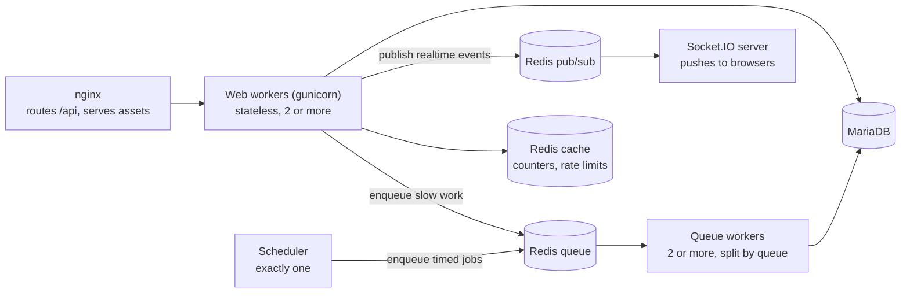

# A2C Design Decisions

Why OAN Access to Credit (A2C) is built the way it is. Each entry says what we decided, why, and what we considered instead, so the trade-off does not have to be argued again.

This is the reasoning, not the reference. For endpoints see `openapi/openapi_v1.yaml` and `A2C_API_Specification.md`. For the reusable catalog design see `dynamic_product_catalog_pattern.md`. For loan status see `loan-status-workflow-plan.md`.

Entries marked **Open** record a decision that shipped without its reason being written down at the time. They say what we know and what still needs confirming.

---

## Contents

**Platform**

1. [One module inside `oan_a2c`, not a separate app](#1-one-module-inside-oan_a2c-not-a-separate-app)
2. [Stateless JWT with rotating refresh tokens](#2-stateless-jwt-with-rotating-refresh-tokens)
3. [REST routes behind Kong](#3-rest-routes-behind-kong)
4. [Runtime: independent processes that talk through Redis](#4-runtime-independent-processes-that-talk-through-redis)

**Tenancy and roles**

5. [A user belongs to a bank through a User Permission, and fails closed](#5-a-user-belongs-to-a-bank-through-a-user-permission-and-fails-closed)
6. [Two bank roles, not eight](#6-two-bank-roles-not-eight)
7. [Only the A2C Administrator uses the Desk](#7-only-the-a2c-administrator-uses-the-desk)
8. [Onboarding: user first, then bank, then platform approval](#8-onboarding-user-first-then-bank-then-platform-approval)

**Catalog**

9. [WooCommerce as the catalog model, trimmed](#9-woocommerce-as-the-catalog-model-trimmed)
10. [Eligibility is stored and filterable, never enforced](#10-eligibility-is-stored-and-filterable-never-enforced)
11. [Who can publish a product](#11-who-can-publish-a-product)
12. [One search seam, database first](#12-one-search-seam-database-first)

**Farmers and applications**

13. [Identity lives on the Farmer Profile, not the Lead](#13-identity-lives-on-the-farmer-profile-not-the-lead)
14. [Fayda is an identifier we verify, not a login](#14-fayda-is-an-identifier-we-verify-not-a-login)
15. [The application is a frozen snapshot](#15-the-application-is-a-frozen-snapshot)
16. [One backend for both sides of the marketplace](#16-one-backend-for-both-sides-of-the-marketplace)
17. [Self-service applications have no lead](#17-self-service-applications-have-no-lead)
18. [The lead follows the loan decision](#18-the-lead-follows-the-loan-decision)

**Data modelling**

19. [Credit info and visits are separate records, not child tables](#19-credit-info-and-visits-are-separate-records-not-child-tables)
20. [Copy hot fields, do not reshape the schema](#20-copy-hot-fields-do-not-reshape-the-schema)
21. [Dashboard counters live in Redis and are reconciled hourly](#21-dashboard-counters-live-in-redis-and-are-reconciled-hourly)
22. [Rules of thumb](#22-rules-of-thumb)

---

# Platform

## 1. One module inside `oan_a2c`, not a separate app

**Decision.** The bank marketplace (banks, products, taxonomy, stages) is the `a2c_marketplace` module inside the same Frappe app as leads and applications.

**Why.**

- Frappe scales per site and per bench (more workers, more replicas), not per app. A second app adds no runtime capacity.
- Banks, products, applications and leads link to each other, and Frappe links cannot cross sites. They have to share one database anyway.
- Tenancy is enforced with User Permissions, which are site-wide.
- One app means one image, one `bench migrate` and one release. Two apps would have to be released in lockstep.

**Considered.** A separate marketplace app. It only pays off if banks and products are reused by an unrelated product line, and nothing points to that.

---

## 2. Stateless JWT with rotating refresh tokens

**Decision.** Frontends log in once and get two tokens:

- a short-lived access token (JWT, HS256, about 15 minutes), sent on every request;
- a long-lived refresh token (1 day, or 30 days with "remember me"), stored in the database only as a hash and replaced every time it is used.

A middleware reads the JWT and sets the Frappe user, so Frappe's own role and permission checks apply unchanged.

**Why.**

- No server-side session, so any backend pod can serve any request. This is what lets the web tier scale horizontally (see 4).
- The frontends are React and Flutter apps, not the Frappe Desk, so cookie sessions add nothing.
- Frappe still does the password check, roles and permissions. We only replaced how the session is carried.
- Storing only a hash means a database leak does not leak usable refresh tokens. Rotation means a stolen refresh token stops working as soon as the real user refreshes.
- Signing keys are chosen by a key ID (`kid`) in the token header, so a key can be rotated without logging everyone out.

**Considered.**

- Frappe cookie sessions: tie a user to server state and do not suit mobile clients.
- Keycloak as the identity provider: written up as a proposal in `identity_management_architecture.md`, not built. Worth revisiting once Fayda login (see 14) is in scope.

---

## 3. REST routes behind Kong

**Decision.** Endpoints are declared as REST routes under `/api/v1` on Frappe's own URL map, instead of Frappe's default `/api/method/<dotted.path>` style. Kong sits in front of everything:

- people send a JWT, checked by Kong's `jwt` plugin;
- partner systems (IVR telco, consent registry) send a Kong API key, restricted by IP;
- for partner webhooks, Kong swaps the partner key for a Frappe service credential before forwarding.

**Why.**

- Stable, resource-shaped URLs do not change when a Python file is moved or renamed. The old dotted paths did.
- An OpenAPI spec and the Kong config can be generated from the declared routes, so documentation and gateway cannot drift from the code.
- Routes marked as guest are also registered as exempt in the JWT middleware from the same declaration, so the two lists cannot drift apart.
- Partners never hold Frappe credentials. Revoking a partner means removing its Kong key, not rotating a platform secret.

**Considered.** Keeping `/api/method` paths. Rejected because every refactor broke the frontend and Postman.

**Note.** Kong's `key-auth` accepts any consumer's key on any key-auth route. If partners must be isolated from each other's webhooks, add Kong's `acl` plugin.

---

## 4. Runtime: independent processes that talk through Redis

**Decision.** In production the app runs as separate processes. None controls another; they coordinate through Redis.

**Why this shape.**

- **Web workers are stateless.** Auth is a JWT, counters and rate limits are in Redis, data is in MariaDB. Any number of pods can serve traffic.
- **The scheduler must be exactly one instance.** Two schedulers would run every timed job twice, for example the hourly counter reconcile.
- **Redis has two separate jobs.** As a queue, each job goes to exactly one worker and waits until taken. As pub/sub, each message goes to every listener and is lost if nobody is listening. The queue Redis must therefore not evict data; the cache Redis can.
- **Workers are split by queue** so a slow external service (the consent registry) cannot hold up everything else.

**Known gaps** (from the architecture review, not all closed):

- Uploaded files are on local disk. Shared storage (EFS or S3) is required before running more than one pod. See `file_storage_architecture.md`.
- No health or readiness endpoint, so Kubernetes cannot route around an unhealthy pod.
- Refresh tokens are never cleaned up, so the table grows without limit.
- No metrics, tracing or log shipping yet.

---

# Tenancy and roles

## 5. A user belongs to a bank through a User Permission, and fails closed

**Decision.** A bank user is linked to their bank by a Frappe **User Permission** record (`allow = A2C Participating Bank`, value = the bank). It is not a field on the user or on the bank. Every bank-scoped record carries its own `bank` field, stamped from the product or the creator, never from the client.

**Why.**

- Frappe's permission engine already understands User Permissions, so the scoping hooks can read one place for every request.
- The bank on a record (which bank owns it) and the bank on a user (which bank they work for) are different facts. Keeping them apart avoids confusing the two.

**Fail closed.** The binding is the only thing that narrows what a bank user sees, so a missing binding is the single point of failure. Every layer treats it as "sees nothing":

- the list filter returns an always-false condition for a bank user with no bank;
- the single-record check denies access;
- the user and the binding are created in one transaction, when a bank is registered or a member is invited, so a half-created bank user cannot exist.

A single function decides who sees every bank (A2C Administrator, Development Agent, System Manager). Every scoping check asks that function instead of listing roles.

See `multi_tenancy.md` for how the scoping is enforced.

---

## 6. Two bank roles, not eight

**Decision.** Banks have two roles: **Bank Admin** (manages the bank, its team, approves products) and **Bank Agent** (drafts products, works applications).

**What was planned.** Eight least-privilege roles translated from e-commerce seller duties (product manager, pricing, analyst, loan officer, servicing, admin, finance, compliance), bundled into four Role Profiles.

**Open.** The flat model shipped and matches the UI mockups. The likely reason is that pilot banks are small teams where one person does several of those jobs, and eight roles would have slowed onboarding. Confirm with product. The finer roles can be added later without a data change, because scoping keys on the bank binding (see 5), not on the role.

---

## 7. Only the A2C Administrator uses the Desk

**Decision.** Only `A2C Administrator` (and Frappe's own System Manager) has Desk access. Bank Admins, Bank Agents, Development Agents and Farmers have none: their roles set `desk_access = 0`, so they are Website Users and work only through the JWT API and their own portal.

**Why.**

- The Desk exposes Frappe's generic list, form and report screens. They were not built for tenants and would show a bank more of the system than its portal does.
- Everything a bank or agent needs is in the API and the portal, where every call goes through the same validation and scoping.
- Users without Desk access do not use System User seats.

**Hiding the Desk is a convenience, not the security wall.** A user with valid credentials can still reach whitelisted framework endpoints. The wall is the JWT middleware plus the bank scoping and fail-closed rules (see 5).

The roles are kept in sync on every migrate. Changing a role's Desk access re-types every user who holds it, so existing bank and agent users become Website Users on the next migrate.

---

## 8. Onboarding: user first, then bank, then platform approval

**Decision.**

1. A person registers an account with the Bank Admin role.
2. They register their bank, upload KYC and add contacts. The bank starts **In Review**.
3. A platform admin approves it (**Active**) or suspends it. A bank can never activate itself.
4. Until the bank is Active, it cannot create or change products.

**Why.**

- User first matches the UI flow and lets one person fill a long form over several sessions.
- The platform approval gate stays, because product writes are only blocked by the bank's status. Self-approval would let a bank publish products with no review.
- Approval is a plain status with a fixed set of allowed moves (In Review → Active or Suspended, Active ↔ Suspended), not a Frappe Workflow. It has one actor and no per-role steps, so a workflow adds nothing.

**Considered.** Creating the bank and its first user together only at approval time. Safer, but it forced registration into one sitting.

---

# Catalog

## 9. WooCommerce as the catalog model, trimmed

**Decision.** Products follow WooCommerce's model: a fixed core record, free key-value meta, a shared term vocabulary, product-term links, and lookup tables for fast reads. The generic version is in `dynamic_product_catalog_pattern.md`. What is specific to A2C:

| WooCommerce              | A2C                       | Choice and reason                                                                                                                                     |
| ------------------------ | ------------------------- | ----------------------------------------------------------------------------------------------------------------------------------------------------- |
| `wp_posts`               | Loan Product              | Core loan terms (amounts, rates, tenure) are real columns, because every loan has them and buyers filter on them.                                     |
| `wp_postmeta`            | Loan Product Meta         | Kept for bank-specific extras. Display only.                                                                                                          |
| `wp_terms`               | Term                      | One table holds every label, so a word is spelled once.                                                                                               |
| `wp_term_taxonomy`       | _(dropped)_               | Replaced by separate Category and Tag tables that each point at a Term. Simpler queries, and each can have its own fields (categories have a parent). |
| `wp_termmeta`            | _(dropped)_               | No use for it yet.                                                                                                                                    |
| `wp_term_relationships`  | Term Relationship         | Categories and tags only.                                                                                                                             |
| Attribute taxonomies     | Attribute Lookup          | Attributes (crop, region, farmer type) are written straight to the lookup instead of through the relationship table. One table to filter, no sync.    |
| `wc_product_meta_lookup` | Loan Product Lookup       | Kept in sync on every product change. Not read by the catalog yet (see 12).                                                                           |
| Variable products        | _(dropped)_               | Every product is flat: one set of terms.                                                                                                              |
| Order item snapshot      | Application Term Snapshot | See 15.                                                                                                                                               |

**Why WooCommerce.** It has run very different shops on one fixed schema for years. Banks will ask for new product properties all the time, and this model absorbs them as data instead of schema changes.

**Vocabulary ownership.** Only platform admins create terms. Banks can only attach existing ones. Letting each bank create words would give "maize", "Maize" and "corn" as three filters.

---

## 10. Eligibility is stored and filterable, never enforced

**Decision.** Eligibility criteria (crop, region, land size, farmer type) are stored on the product as attributes. Farmers can filter the catalog by them. Nothing blocks a farmer from applying to a product whose criteria they do not meet.

**Why.**

- Automatic matching needs reliable farmer data (land size, crop) that we only get after consent, which comes after browsing.
- Banks make the credit decision. A wrong automatic rejection loses a customer; a wrong application costs the bank a quick look.
- Filtering gives most of the benefit with none of the risk.

**Considered.** A matching engine that hides or blocks ineligible products. Out of scope for now. It can be added later on top of the same attribute data.

---

## 11. Who can publish a product

**Decision.**

- A product a **Bank Admin** creates goes live at once.
- A product a **Bank Agent** creates starts as **Pending Approval**. The Bank Admin is notified and must approve or reject it, with a reason.
- A Bank Agent cannot change the content of a live product. Editing a rejected product sends it back for approval.
- Products are archived, never deleted, so applications that point at them keep their history.

**Why.** The mockups and the original plan disagreed (always live, always approved, or always draft). The rule above gives banks a four-eyes check on staff without making the admin approve their own work. Approval is a Bank Admin decision, not a platform one: the platform approves the bank once (see 8), and the bank is responsible for its own products.

---

## 12. One search seam, database first

**Decision.** MariaDB serves the catalog. All catalog search should go through one function, so an external search engine can be added later by changing only that function.

**Why.**

- Structured filters (amount, rate, tenure, bank, category) over thousands of products are well within what an indexed database handles.
- An engine such as Typesense or Meilisearch is justified only by features a database does badly: typo tolerance, relevance ranking, Amharic stemming, type-ahead. Catalog size alone does not justify one.
- When an engine is added, it ranks and returns one page of IDs. Frappe then loads those IDs by primary key and applies the normal permission rules. Access rules stay in one place and the database only does fast ID lookups.

**Known gaps.**

- Text search uses `LIKE '%word%'`, which cannot use an index. Fine at today's size.
- The catalog reads the product table directly, not the Loan Product Lookup. Add lookups when a measured query needs them.

---

# Farmers and applications

## 13. Identity lives on the Farmer Profile, not the Lead

**Decision.** The **Farmer Profile** is the one record per person. It holds the national ID (unique), demographics and, for self-service farmers, a link to their login. Leads and applications point at it.

**Why.**

|                 | Lead                                           | Farmer Profile        |
| --------------- | ---------------------------------------------- | --------------------- |
| How many        | One per opportunity, many per person over time | One per person        |
| Lifetime        | Closes when the opportunity ends               | Permanent             |
| Duplicate check | None                                           | National ID is unique |
| Owner           | The field agent it is assigned to              | The farmer            |

Putting the login on the lead breaks the first time a farmer applies twice.

Identity and profile data are 1:1 with the same lifetime, so they share one record with optional fields that fill in over time. A second 1:1 table would only add a join. Verification events are many per person, so they would get their own table.

A profile can be linked to an agent, a farmer login, both, or neither (a raw IVR referral). The profile's `user` field answers "can this farmer log in?". The lead's assignee answers "which agent works this?".

---

## 14. Fayda is an identifier we verify, not a login

**Decision (target).**

- Typing a Fayda ID proves nothing. An account is created only after Fayda verification (OTP) succeeds, and only after checking that no profile with that ID already exists.
- Fayda verification is for signup, sensitive actions (applying, giving consent) and recovery. Day-to-day login is phone OTP or password, issuing the normal JWT (see 2).
- **Identity proofing** ("are you this Fayda holder?") and **data-sharing consent** ("may we pull your data for this purpose until this date?") are two different uses of the same OTP service. They are recorded separately so empty consents do not pollute the consent audit trail.

**Status.** Farmers currently log in with email and password as a stand-in. Fayda OAuth is the target.

---

## 15. The application is a frozen snapshot

**Decision.** When an application is created it copies what the bank needs to decide on:

- the farmer's data at that moment, under a specific consent;
- the product's category and tag names;
- the product and bank as plain text, not live links.

**Why.**

- The bank underwrites what the farmer agreed to share, at the time they shared it. The profile can change afterwards without changing a submitted application.
- Consent is bound to a purpose and a validity window, so it is taken per application, not once per farmer.
- Plain-text copies mean archiving or renaming a product, or retiring a category, never breaks old applications or reports.

The profile is a cache of the latest known data. The applications are the ledger.

---

## 16. One backend for both sides of the marketplace

**Decision.** Banks and farmers use the same backend and database. Each side publishes one thing the other reads:

|            | Loan product                     | Loan application                             |
| ---------- | -------------------------------- | -------------------------------------------- |
| Written by | A bank                           | A farmer or an agent                         |
| Visible to | Every buyer (live products only) | Only the bank it was sent to, and its author |

The **loan application** is where the two sides meet, so it is scoped by who is looking:

- a bank user sees only applications for their bank, and only after submission (a draft is private to its author);
- a farmer sees only their own;
- a Development Agent sees agent-sourced applications across banks, not farmers' self-service ones;
- platform admins see everything.

**Why one backend.** Split systems by the data they share, not by who uses them. Both sides read and write the same application, so separating them would mean syncing it between two databases. Separate services only help scaling when each owns its own data.

The catalog needs no buyer-side security scope. It is public to every logged-in buyer; filtering by amount or eligibility is a query filter, not access control.

---

## 17. Self-service applications have no lead

**Decision.** An agent's path is Lead → Application. A farmer's path is Profile → Application, and no lead is created.

**Why.** A lead is a back-office opportunity for an agent to work. A farmer who has applied is an applicant, not a lead. Creating a lead in front of them would put self-service applications into the agents' work queue.

---

## 18. The lead follows the loan decision

**Decision.** When a bank moves an agent-sourced application to a final stage, the lead follows:

- a successful final stage (for example Disbursed) grants the lead, moving it through Processed first if needed;
- any other final stage rejects the lead.

**Why.**

- The bank decides on the loan. Asking a Bank Agent to repeat that decision on the lead meant leads were left open.
- The trigger uses the stage's archetype (see `loan-status-workflow-plan.md`), not its label, so it works whatever a bank calls its stages.
- The lead moves run as a system action, because the lead workflow gives Mark Processed to Development Agents and Grant to Bank Agents, while a Bank Admin may also close a loan.
- It is best effort. If the lead cannot follow (it is Dormant, or already closed), the loan decision still stands and the failure is logged.

---

# Data modelling

## 19. Credit info and visits are separate records, not child tables

**Decision.** A lead's credit information and field visits are their own records that point back at the lead, not child tables inside it.

**Why.**

- A child table is saved with its parent. Changing one visit's status would load and save the whole lead, and two agents updating different visits on the same lead would collide on the lead's edit timestamp.
- Separate records have their own permissions, status, history and API.
- Both are histories: a re-application or a rescheduled visit adds a second row. Flattening them into fields on the lead would lose that history.

Credit information could be a child table, since it is mostly added and read. It stays separate for consistency and its own create permission.

---

## 20. Copy hot fields, do not reshape the schema

**Decision.** When a list view needs a value from a related record on every load, copy that value onto the parent with a sync hook, instead of changing the schema. For example, the lead carries a copy of its latest loan amount, kept in sync whenever credit information changes.

**Why.** The history stays in its own table, the list needs no join, and the copy can always be recomputed from the source.

---

## 21. Dashboard counters live in Redis and are reconciled hourly

**Decision.** Bank dashboard numbers (products by status, applications by stage) are Redis counters, updated as records change. An hourly job recounts them from the database and corrects any drift.

**Why.**

- Dashboards load often and would otherwise run several counting queries per bank on every view.
- Counting on write is fast but can drift (a failed hook, a direct database change). The hourly reconcile bounds how wrong a number can be.
- Counters leave out the farmer's private draft applications, so a dashboard card never shows a number the list under it cannot show.

---

## 22. Rules of thumb

These came up again and again in the decisions above.

- **One current value is a field. A history of events is its own table.**
- **1:1 with the same lifetime: one table with optional fields. Different count or lifetime: separate tables.**
- **A child table is saved with its parent. A linked record is saved on its own.** If you need to update, permission or list one row by itself, it is not a child table.
- **Copy a hot field with a sync hook instead of reshaping the schema.**
- **Keep the workflow fixed and the labels flexible.** Code branches on platform states, never on names a tenant can change.
- **Scope in one place, and fail closed.** Every read that bypasses the shared scope must say so.
- **Split systems by the data they share, not by who uses them.**
- **Snapshot anything a decision was based on.**
