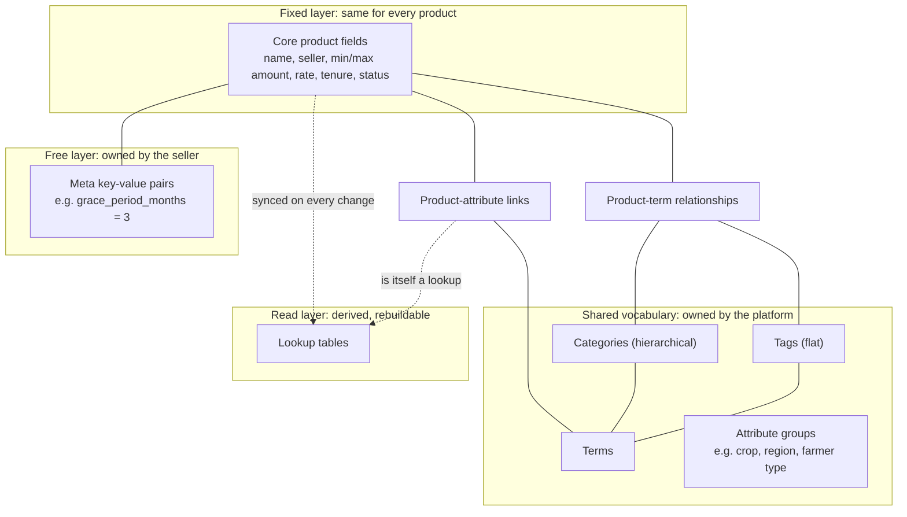
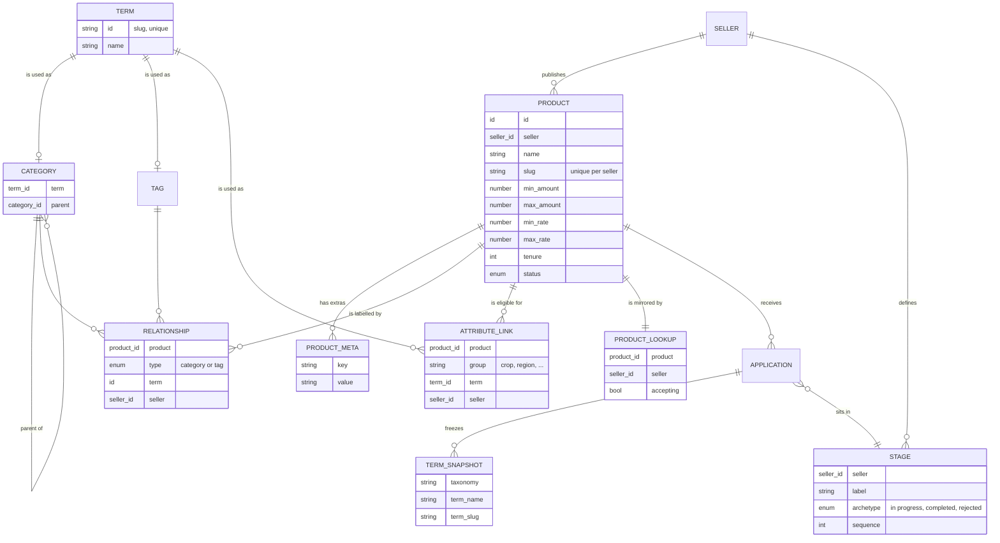
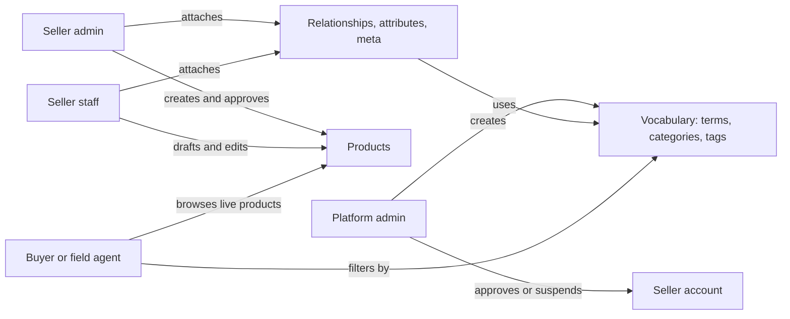
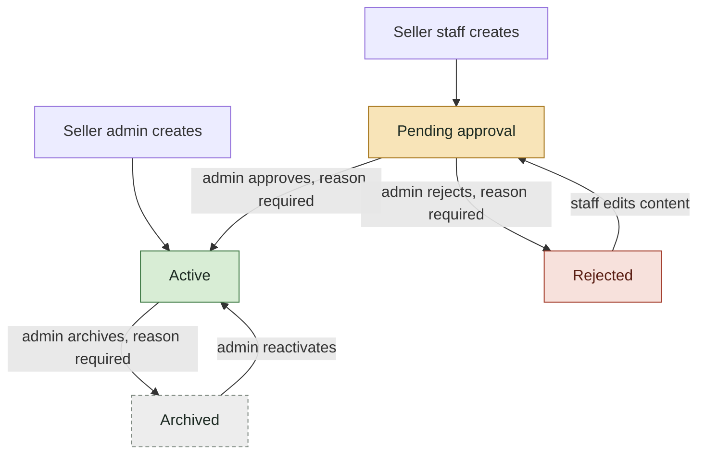
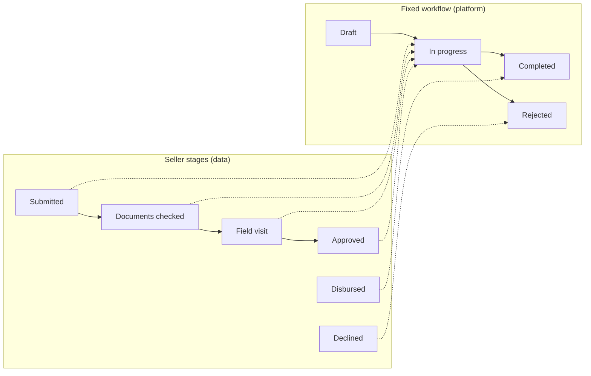
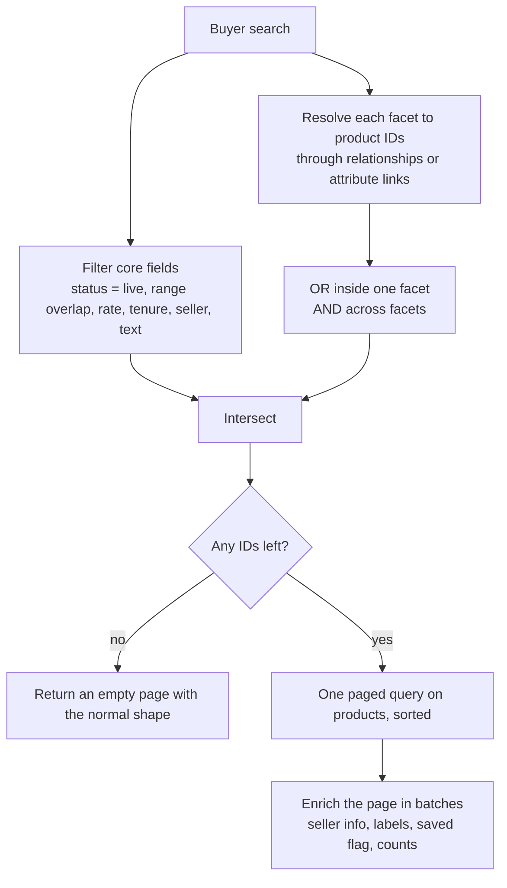
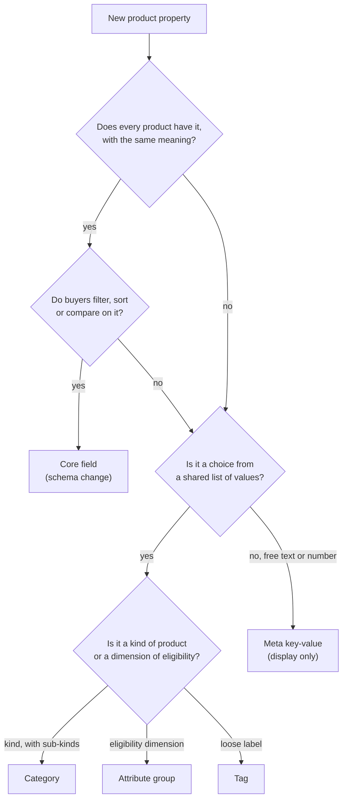

# Dynamic Product Catalog Pattern

A reusable design for a marketplace where many sellers publish products that do not share one fixed shape. It borrows the product and taxonomy model from WooCommerce and adds multi-tenancy, approval and configurable workflows on top.

We built it for a multi-bank agricultural loan marketplace (OAN A2C), where banks are the sellers and loan products are the products. Nothing in the pattern depends on loans, banks or any one framework. Swap "bank" for "vendor" and "loan product" for "listing" and it applies to any multi-seller catalog.

---

## 1. The problem

A marketplace catalog has two opposing needs:

- **Every product must be comparable.** Buyers filter, sort and compare across sellers, so some properties must exist on every product with the same meaning and type.
- **Every seller is different.** One bank offers a loan only for coffee growers in two regions, another adds a grace period, a third wants a "women farmers" label. A fixed table with a column per idea grows forever and needs a schema change for each new seller requirement.

The pattern solves this by splitting product data into layers. Each layer has a clear owner and a clear job.

---

## 2. The idea in one picture

| Layer                        | Owner                 | Changes how often         | Can buyers filter on it?     |
| ---------------------------- | --------------------- | ------------------------- | ---------------------------- |
| Core fields                  | Platform (schema)     | Rarely, needs a migration | Yes, with ranges and sorting |
| Shared vocabulary            | Platform admin (data) | Any time, no migration    | Yes, as facets               |
| Relationships and attributes | Seller                | Per product               | Yes, through the vocabulary  |
| Meta                         | Seller                | Per product               | No, display only             |
| Lookups                      | System                | On every product change   | Used to make filtering fast  |

---

## 3. Where it comes from: WooCommerce

WooCommerce (the WordPress shop plugin) has run millions of very different stores on one fixed schema. It does this with four ideas. We copied all four.

| WooCommerce concept   | What it does                                                                  | Our equivalent                            |
| --------------------- | ----------------------------------------------------------------------------- | ----------------------------------------- |
| Post (product)        | The record every product has                                                  | Core product                              |
| Post meta             | Unlimited key-value pairs per product                                         | Product meta                              |
| Terms + term taxonomy | One pool of words, each word belongs to a taxonomy (category, tag, attribute) | Terms, categories, tags, attribute groups |
| Term relationships    | Many-to-many link between products and terms                                  | Product-term relationships                |
| Product lookup tables | Denormalised copies for fast shop queries                                     | Product lookup, attribute lookup          |
| Order item snapshot   | An order keeps what was bought, even if the product later changes             | Application term snapshot                 |

What we added on top, because WooCommerce is a single-seller shop:

- **Tenancy.** Every seller-owned row carries the seller ID.
- **Approval.** A product is reviewed before it goes live.
- **Split ownership.** The platform owns the vocabulary, sellers only use it.
- **Configurable pipeline.** Each seller names its own processing stages on top of a fixed workflow.

---

## 4. Data model

### 4.1 Core product

The fields every product has, typed and indexed. Put a property here only when all three are true:

1. Every product has it.
2. Buyers filter, sort or compare on it.
3. It has one meaning across all sellers.

Amounts, interest rates, tenure and status pass that test. "Grace period" does not, because most products do not have one.

Store ranges as two columns (`min_amount`, `max_amount`) rather than one value. Buyers search with a range too, and the correct match is an overlap:

> product.max ≥ requested.min **and** product.min ≤ requested.max

Comparing min to min and max to max is the most common filtering bug in this kind of catalog.

### 4.2 Product meta

A child table of free key-value pairs per product. The seller can add anything without a schema change, such as `grace_period_months = 3` or `collateral = none`.

Rules:

- Meta is for **display**, never for filtering. If buyers need to filter on it, promote it to a vocabulary attribute or a core field.
- Validate key and value length. Do not validate content, because there is no shared meaning to check against.
- Replace the full list on update. Merging key by key adds complexity nobody needs.

### 4.3 Shared vocabulary

One pool of **terms**. Each term is a word with a stable slug ID, such as `coffee` or `oromia`. A term becomes useful by being given a role:

- **Category.** A hierarchy (parent and child). Answers "what kind of product is this?", for example _Input loan > Seed loan_. Usually one or two per product.
- **Tag.** Flat labels for cross-cutting ideas, such as _women farmers_ or _quick disbursal_.
- **Attribute group.** A named dimension of eligibility, such as crop, region or farmer type. A product links to several terms per group: "crop: coffee, teff".

The platform admin owns the vocabulary. Sellers can read it and attach it to their products, but cannot create new words. This is what keeps facets clean. Without it, every seller spells "maize" differently and the filter list becomes useless.

Slug rules that save pain later:

- Lowercase letters, digits and hyphens only. Removing commas matters, because filters are often passed as `?category=a,b`.
- Unique across all terms. On a clash, add `-2`, `-3`.
- Provide a fallback for names that have no Latin characters (for example Amharic), since they slug to an empty string.

### 4.4 Relationships and attribute links

Many-to-many tables between products and terms. Each row carries the seller ID copied from the product, so tenant scoping works on these tables without a join.

Set them as a full list per product and let the server compute the difference: delete what was removed, insert what was added. The client never sends "add" or "remove" operations, only "this is the list now". That keeps every call safe to repeat.

### 4.5 Lookup tables

Derived tables shaped for the buyer's queries: one row per product with the flags and counters the catalog needs, such as "accepting applications", "featured" or "number of applications".

- They are **never written by users**. Events on the product (saved, deleted) keep them in sync.
- They must be **rebuildable** from the source tables by a single maintenance job. Treat them as a cache, not as a source of truth.
- Build them **when a query needs them**. A lookup table that no query reads is only a sync cost. Start by querying the core table directly and add a lookup once a measured query is too slow.

### 4.6 Application snapshot

When a buyer applies, copy the product's category and tag names onto the application. The product may later be renamed, re-labelled or archived. The application still shows what the buyer applied for, and reports stay stable.

Snapshot once, at creation. Do not refresh it on later saves.

---

## 5. Who can do what

- The platform owns the **words**, sellers own the **products** and the **links**.
- Seller staff can draft. Only a seller admin (or the platform) can make a product live.
- Buyers only see live products. They see every seller's catalog, but never another buyer's data.

---

## 6. Multi-tenancy

Every seller-owned table carries the seller ID: products, relationships, attribute links, lookups, stages and applications.

- Apply the "own seller only" filter in **one central place** that every read goes through, not in each endpoint.
- List any low-level read that skips that central filter, and require each one to add the filter explicitly or carry a written reason. A static check in CI that fails the build on an unmarked read is cheap and catches the leaks code review misses.
- Keep one function that answers "does this user see all sellers?" (platform staff) instead of repeating role checks.
- Copy the seller ID onto child and link rows from the parent product at write time. Never take it from the client.

---

## 7. Product lifecycle

Rules worth copying:

- **Approval sticks to content.** If staff change a content field (name, amounts, rate, tenure, description) on a live product, block it or send it back for review. Changing labels or meta does not need re-approval.
- **A seller that is not approved cannot publish.** Check the seller's own status on every product write, not only at login.
- **Archive instead of delete.** Applications point at products, so hard delete breaks history. Archived products leave the catalog but stay readable.
- **Every status change needs a reason and an audit record.** Setting the status a product already has is a success, not an error.

---

## 8. Configurable pipeline on a fixed workflow

The same "fixed core, flexible surface" idea applies to application status.

- The platform defines a small, fixed set of workflow states (**archetypes**) that the code relies on: draft, in progress, completed, rejected.
- Each seller defines its own **stages**, with a label, an order, and the archetype each maps to. New sellers start from a seeded default list.
- Buyers, agents and sellers all see the **stage label**. Code and reports use the **archetype**.
- Moving between two stages of the same archetype is a stage change only. Moving into a new archetype goes through the workflow and its role checks.
- Store the stage label on the application as well as the stage ID, so a seller renaming a stage can be applied deliberately instead of silently changing history.

---

## 9. Catalog query recipe

- **Facet values come from the vocabulary**, not from scanning products. The filter list stays stable and cheap.
- **OR inside a facet, AND across facets.** Ticking _coffee_ and _teff_ means either crop. Adding region _Oromia_ narrows both.
- **Narrow, never widen.** Facet lookups only produce candidate IDs. The final product query still runs through the tenant and visibility rules, so naming a hidden product in a filter cannot reveal it.
- **Short-circuit empty results** before querying, but return the same response shape as a full page.
- **Enrich in batches** of one query per concern for the whole page, never one query per product.
- **Whitelist sort keys**, mapping each public key to a fixed order clause.

---

## 10. Where does a new property go?

---

## 11. Replication checklist

1. **Seller and tenancy.** Create the seller entity with a status (in review, active, suspended). Add the central "own seller only" filter and the "sees all sellers" check.
2. **Core product.** Define the fields that pass the three-part test in 4.1. Add status, a per-seller unique slug, and validation for ranges and limits.
3. **Meta.** Add a key-value child table on the product.
4. **Vocabulary.** Add terms with slug IDs, then categories (with parent), tags and attribute groups on top of terms. Give only platform admins create rights.
5. **Links.** Add product-term relationships and product-attribute links, each carrying the seller ID. Expose "set the full list" endpoints.
6. **Lifecycle.** Add the product status machine, the approval role check, the "seller must be active" check, reasons and an audit log.
7. **Catalog.** Build the query recipe in section 9. Add a facets endpoint that reads the vocabulary.
8. **Lookups.** Add a lookup table only for a query that measurably needs it. Keep it in sync with product events and add a rebuild job.
9. **Applications.** Snapshot the product's terms at creation. Add the fixed workflow and the per-seller stages with a seeded default.
10. **Guard rails.** Add the CI check for unscoped reads. Test cross-seller access both ways.

---

## 12. Lessons learned

- **Ownership of the vocabulary matters more than its structure.** Letting sellers create terms feels flexible, but it ruins facets within weeks.
- **Meta is a trap if it grows filters.** Once people ask to filter on a meta key, promote it. Do not add meta-value search.
- **Denormalised tables cost sync work.** Add them in response to a slow query, and always make them rebuildable.
- **Range filters need overlap logic.** Test with a product whose range sits partly inside the requested range.
- **Snapshots protect history.** Anything shown on a submitted application should not change when the seller edits the product.
- **Keep the workflow fixed and the labels flexible.** Code that branches on seller-defined labels breaks the day a seller renames one.
- **Scope in one place and test the bypasses.** Tenant leaks come from the one read that skipped the shared filter, not from the main path.
